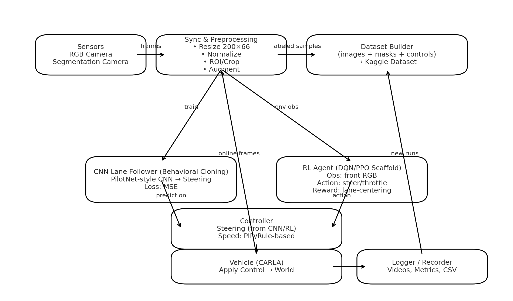

# 🚗 CARLA Autonomous Driving – Capstone (Lane Following & RL)

**Author:** Sai Nithin Krishna Souram  
**Dataset:** https://www.kaggle.com/datasets/sainithin9/carla-dataset-for-rl-and-driving

> End-to-end pipeline for autonomous driving in CARLA: data collection → training → evaluation → real-time driving.  
> Primary focus: **lane following with a CNN (behavioral cloning)**, with hooks for **RL experiments** and **segmentation-assisted control**.

---

## Table of Contents
- [1. Project Goals](#1-project-goals)
- [2. Why These Methods? (Design Decisions)](#2-why-these-methods-design-decisions)
- [3. Repository Layout](#3-repository-layout)
- [4. Setup & Installation](#4-setup--installation)
- [5. Dataset Download & Structure](#5-dataset-download--structure)
- [6. How to Reproduce](#6-how-to-reproduce)
- [7. Algorithms (Pseudocode)](#7-algorithms-pseudocode)
- [8. Evaluation & What to Expect](#8-evaluation--what-to-expect)
- [9. Troubleshooting](#9-troubleshooting)
- [10. Alternatives & Next Possibilities](#10-alternatives--next-possibilities)
- [11. Notes, Credits, and License](#11-notes-credits-and-license)

---

## 1. Project Goals
1. **Collect** high-quality driving data from CARLA (RGB, segmentation, steering/throttle/brake).  
2. **Train** a light, real-time **CNN for lane following** (behavioral cloning).  
3. **Deploy** the model inside CARLA for **closed-loop control**.  
4. **Record** outputs (videos, logs) for analysis.  
5. **Explore RL** baselines/framework (DQN/PPO scaffolding) for future work.

---

## 2. Why These Methods? (Design Decisions)

### 2.1 Behavioral Cloning (CNN) for Lane Following
- **Why:** Fast to implement, data-efficient in simulators, stable for lane-keeping.  
- **Tradeoff:** Learns from demonstrations → can copy human/autopilot mistakes; less optimal than RL in novel situations.
- **My choice:** Start with a **PilotNet-inspired** compact CNN (resized input ~**200×66**, 3 channels) to keep inference **fast** and **stable**.

### 2.2 Segmentation-Assisted Understanding
- **Why:** Semantic masks highlight lanes/road vs. background, improving robustness in varied lighting and clutter.
- **How used here:** To **visualize** and optionally **condition** training (e.g., crop/weight lane regions) and to create explainable demos (`seg_out.mp4`).

### 2.3 RL (DQN/PPO) as a Secondary Track
- **Why:** RL can discover policies beyond demonstrations (overtaking, recovery).  
- **Status:** Hooks + pseudocode included for future extension; core submission focuses on supervised lane following for reliability.

### 2.4 Paths & Project Structure
- **Windows target path (used during development):**  
  `C:\CARLA_0.9.15\WindowsNoEditor\PythonAPI\examples\Project\lane_new`  
  `C:\CARLA_0.9.15\WindowsNoEditor\PythonAPI\examples\Project\lane_seg`  
  Reason: easy access to CARLA’s PythonAPI, consistent relative imports, and video/output folders.

---

## 3. Repository Layout
```

camera\_manager.py     # Sensor setup: RGB & segmentation cameras (FOV, resolution, transforms)
collect\_data.py       # Drive (manual/autopilot), log frames + steering/throttle/brake to disk
controller.py         # Inference: loads CNN, predicts steering, simple throttle/brake logic
drive.py              # Runs the agent in CARLA, wiring sensors → model → control
record\_outputs.py     # Saves evaluation runs and renders demo videos (e.g., seg\_out.mp4)
train\_lane\_model.py   # CNN training pipeline for lane following (behavioral cloning)
seg\_out.mp4           # Sample segmentation demo run
requirements.txt      # (Recommended) Python dependencies

````

---

## 4. Setup & Installation

### 4.1 Prerequisites
- **CARLA 0.9.15** (tested): https://carla.org  
- **Python 3.9–3.11**  
- **GPU** recommended for training (CUDA) but optional.

### 4.2 Clone & Install
```bash
git clone https://github.com/<your-username>/AI2_Final_Project.git
cd AI2_Final_Project
pip install -r requirements.txt
````

**Minimal `requirements.txt` (example):**

```
carla
pygame
opencv-python
numpy
pandas
torch
torchvision
matplotlib
tqdm
```

### 4.3 Launch CARLA

* **Linux/macOS:** `./CarlaUE4.sh -quality-level=Epic -ResX=1280 -ResY=720`
* **Windows:** run `CarlaUE4.exe` (consider `-dc` for offscreen/low GPU usage)

---

## 5. Dataset Download & Structure

### 5.1 Download (Kaggle CLI)

```bash
# Configure Kaggle token first (~/.kaggle/kaggle.json)
kaggle datasets download -d sainithin9/carla-dataset-for-rl-and-driving
unzip carla-dataset-for-rl-and-driving.zip -d data/
```

### 5.2 Expected Layout

```
data/
  rgb/                # RGB frames (e.g., 000001.jpg ...)
  segmentation/       # segmentation masks aligned to rgb frames
  controls.csv        # frame_id, steering, throttle, brake, ts
  train.csv           # (optional) splits with frame paths + labels
  val.csv
  test.csv
```

> If your folders differ, update the paths inside `train_lane_model.py` and `collect_data.py`.

---

## 6. How to Reproduce

### 6.1 Collect Your Own Data (optional)

1. Start CARLA.
2. Run:

   ```bash
   python collect_data.py
   ```
3. Drive manually with keyboard (or enable CARLA autopilot in the script).
4. Outputs:

   * `data/rgb/`, `data/segmentation/`
   * `data/controls.csv`

**Design notes:**

* Camera resolution, FOV, and transform are set in `camera_manager.py`.
* Collection loop syncs sensors and control to keep frame-label alignment stable.

### 6.2 Train the Lane-Following CNN

```bash
python train_lane_model.py \
  --data_root data \
  --epochs 30 \
  --batch_size 64 \
  --lr 1e-3 \
  --img_w 200 --img_h 66
```

* Saves model to: `models/lane_model.pth`

**Model (baseline):**

* Resize to **200×66**, normalize, optional center crop.
* Compact CNN (PilotNet-style) → FC layers → single **steering** output.
* **Loss:** MSE between predicted and ground-truth steering.
* **Augmentation:** random brightness, horizontal shifts (small), blur (optional).
* **Reasoning:** fast inference, stable training, good fit for lane following.

### 6.3 Drive Autonomously

```bash
python drive.py \
  --model_path models/lane_model.pth \
  --use_segmentation False
```

* Loads the trained model, feeds live camera frames, outputs control.
* Throttle/brake kept simple; feel free to swap in a PID for speed control.

### 6.4 Record Outputs

```bash
python record_outputs.py \
  --out_dir runs/2025-09-17
```

* Saves logs and demo videos (see `seg_out.mp4` example).

---

## 7. Algorithms (Pseudocode)

### 7.1 Data Collection (Behavioral Cloning)

```text
init carla client, world, sync_mode
spawn ego vehicle
attach RGB + SEG cameras
loop:
  read keyboard/autopilot control  → (steering, throttle, brake)
  tick world; grab synced sensor frames
  save rgb_frame to data/rgb/{frame_id}.jpg
  save seg_mask  to data/segmentation/{frame_id}.png
  append row to controls.csv: (frame_id, steering, throttle, brake, timestamp)
```

### 7.2 Lane-Following CNN Training

```text
load train/val splits from data/*.csv
for each epoch:
  for batch in train:
    img = preprocess(img, resize=200x66, normalize, augment)
    y_hat = cnn(img)             # predict steering
    loss = mse(y_hat, y_true)
    backprop + optimizer step
  validate on val; early stop on plateau
save best model (min val loss)
```

### 7.3 Online Inference + Control

```text
load lane_model.pth
start carla, attach RGB camera
while running:
  frame = latest_rgb()
  x = preprocess(frame)
  steer = cnn(x).item()
  throttle, brake = simple_speed_controller()    # e.g., target speed 20–30 km/h
  apply_control(steer, throttle, brake)
```

### 7.4 RL Scaffold (DQN/PPO baseline – future)

```text
env = CarlaEnv(observation=front_rgb, action=[steer, throttle], reward=lane_centering - offroad_penalty)
agent = DQN() or PPO()
for episode in range(N):
  s = env.reset()
  done = False
  while not done:
    a = agent.act(s)
    s2, r, done, info = env.step(a)
    agent.learn(s, a, r, s2, done)
    s = s2
evaluate and save policy
```

**Why RL later?** It can learn recovery behaviors and optimize long-horizon objectives, but needs careful reward shaping and is compute-intensive.

---

## 8. Evaluation & What to Expect

* **Offline:** steering MAE/MSE on `val/test` CSVs; learning curve plots.
* **Online:** qualitative stability (no oscillations), **lane-center offset**, **off-road %**, collisions.
* **Video:** demos via `record_outputs.py` (e.g., `seg_out.mp4`).
* **Tip:** If oscillations occur → reduce output gain, smooth steering (EMA), crop sky/dash.

---

## 9. Troubleshooting

* **No frames saved:** ensure CARLA is in **sync mode** and that `world.tick()` matches sensor reads.
* **Model overfits:** add augmentation, drop near-duplicate frames, balance left/right turns.
* **Jitter/oscillation:** low-pass filter steering; reduce FOV; tune throttle with PID.
* **Segmentation misaligned:** verify sensor transform/time sync; save frame IDs atomically.
* **Kaggle CLI error:** place `kaggle.json` in `~/.kaggle/` with correct permissions.

---

## 10. Alternatives & Next Possibilities

### 10.1 Control & Planning

* **Classical CV + PID:** Canny/Hough to detect lanes → curvature → **Pure Pursuit** or **Stanley** controller (very interpretable).
* **Imitation Learning (DAgger):** iteratively add recovery demos to reduce compounding errors.
* **RL Upgrades:** PPO/SAC with **curriculum** + **domain randomization** (weather, time of day).

### 10.2 Perception

* **Better Backbones:** EfficientNet/MobileNetV3 for faster lane CNN; or **Temporal** models (ConvLSTM/1D-TCN).
* **Segmentation Models:** DeepLabV3+, Fast-SCNN; use masks to **weight** lane pixels during loss.
* **Multi-sensor:** add depth or LiDAR for obstacle-aware driving.

### 10.3 Robustness & Sim2Real

* **Domain Randomization:** heavy augmentation (exposure, shadows, rain).
* **Feature cropping:** remove sky/hood; focus on road ROI.
* **Mixed datasets:** blend CARLA with real dashcam lane sets for transfer learning.

### 10.4 MLOps & Reproducibility

* Config files (`.yaml`) for hyperparams; **seeds** for determinism;
* **W\&B/MLflow** logging; Docker for portable environments.

---

## 11. Notes, Credits, and License

* Built with **CARLA 0.9.15** and PyTorch.
* Dataset collected and organized by **Sai Nithin Krishna Souram**.
* Academic use encouraged; please credit this repository and the Kaggle dataset when using the data or code.

---
## 🧭 System Architecture



